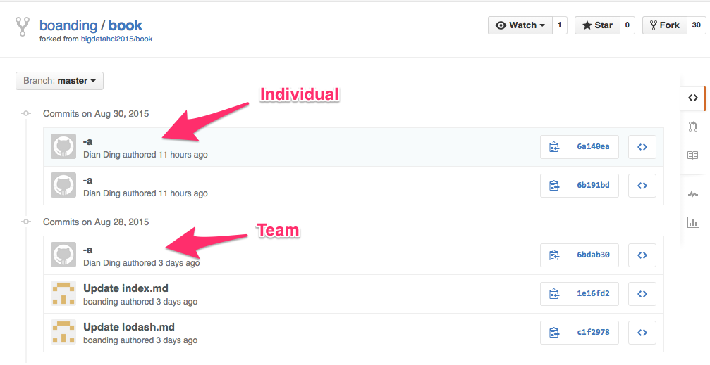
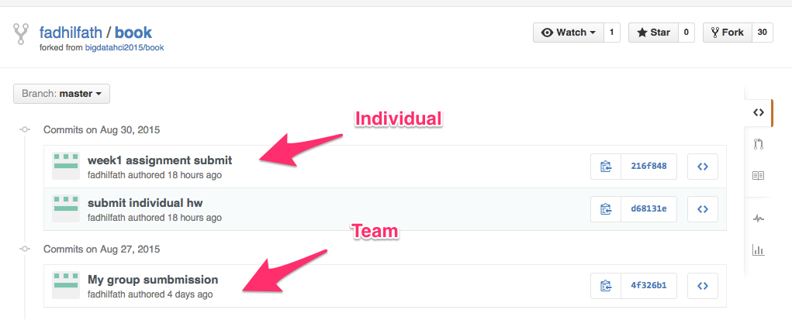
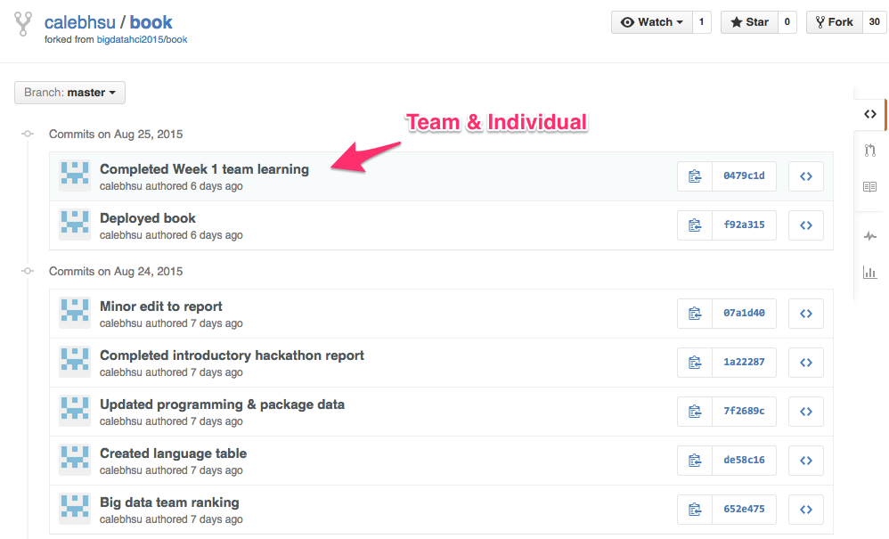

# Week 1 - Classmates

Date: August 31, 2015

## Review: Submissions

Did you submit your team/individual learning challenges correctly? We look at TWO things: your __commit history__ and __published book__.

### 1. Commit History

The commit history of your book shows one commit by Friday night and the other one by Sunday night, for example

* [fadhilfath's commit history](https://github.com/fadhilfath/book/commits/master)
    
* [boanding's commit history](https://github.com/boanding/book/commits/master)
    

If you finished the individual portion together with the team portion by the Friday night deadline, it is okay
to have both in a single commit, for example

* [calebhsu's commit history](https://github.com/calebhsu/book/commits/master)
    

### 2. Published Book

Your book has been published with the most update-to-date contents, for example

* [kjblakemore's book](http://kjblakemore.github.io/book/learning/week1/)

## Setup

1. Fetch and pull in new templates

        $ git fetch upstream

        $ git merge upstream/master

   Read documentation about Github's fork syncing mechanisms [here](https://help.github.com/articles/syncing-a-fork/).

1. Update modules and plugins

        $ npm update

If you are successful, you should be able to see materials about today's hackathon, for instance,
the [warmup exercises](http://doubleshow.github.io/book/hackathons/classmates/warmup.html).

## Hackathon

1. Warmup  (30 minutes)
1. Analysis (30 minutes)
1. Report (1 hour)
